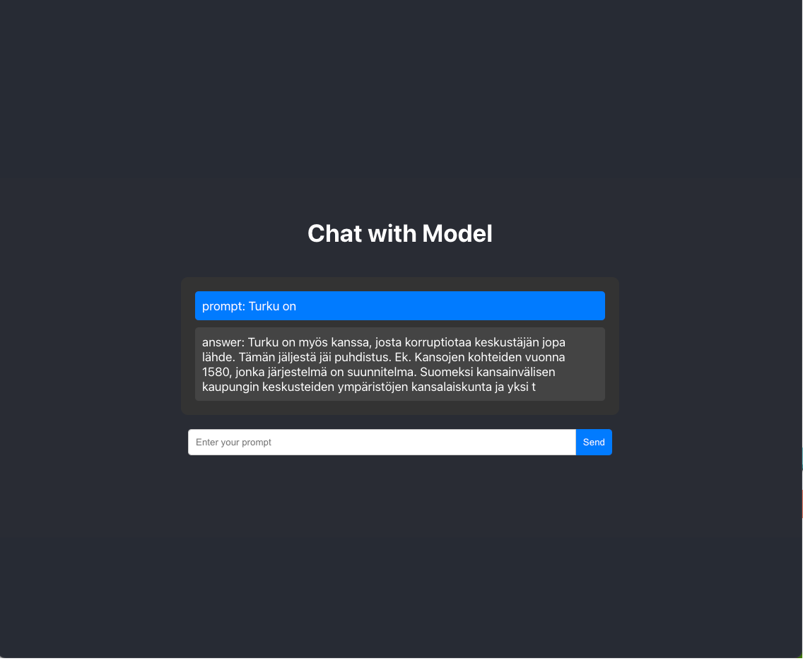

# minichatgpt
Writing a chatgpt like service from scratch including the model, api and UI

## CAM (crazyassmodel) Model
Current model architeture is pretty similar to Llama
- rope
- Swiglu
- rmsnorm
- etc.

## API

## UI
This demo uses:

76M parameter model trained on 4M tokens

| Parameter     | Description                  | Value        |
|---------------|------------------------------|--------------|
| `block_size`  | Size of each block           | 128          |
| `batch_size`  | Size of each batch           | 32           |
| `emb_dim`     | Embedding dimension          | 512          |
| `n_layers`    | Number of layers             | 8            |
| `n_head`      | Number of attention heads    | 8            |
s

To-do
- Optimizing pre-training
- Optimizing inference
- Getting good dataset
- Finetuning
- Deployment
